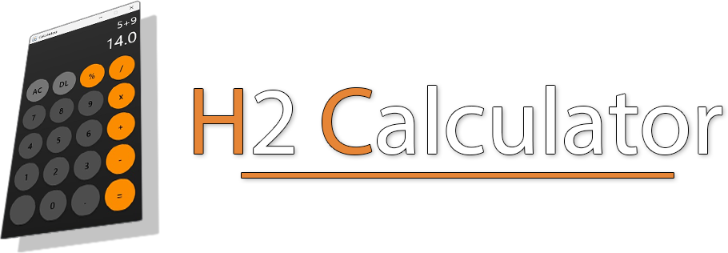
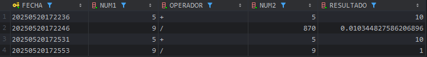
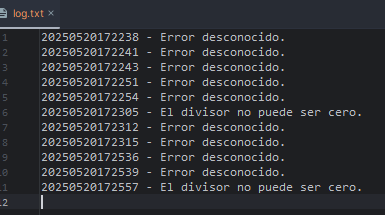
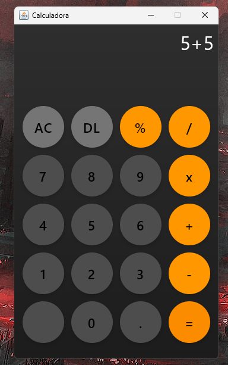
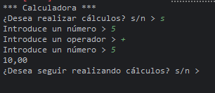

<p align="center"></p>

<p align="center">
  
  
  
</p>

# Calculadora Básica H2 Modo consola + Modo gráfico

Calculadora básica diseñada con soporte para persistencia de datos en una database H2 con HikariCP para el pool de conexiónes. Cuenta con dos modos de ejecución:
- **Modo gráfico**: Con `Jetpack Compose`.
- **Modo consola**: Utilizando la `terminal` (si se lanza con parámetros).

También cuenta con un registro de logs mediante archivos `.txt`. En el caso de que ocurra algún error en cálculo u otros, se realizarán guardados del mensaje
en un archivo de texto junto a su fecha y hora correspondientes.

Si bien el proyecto no sigue las directrices exactas de un proyecto con patrón de software DAO al uso (ya que utilicé un proyecto que realicé hace un mes) creo que la
separación por capas está bien definida:
- **Capa dao**: Encargada del acceso a datos y gestión de la db.
- **Capa model**: Contiene las clases que representan el dominio del negocio y la lógica de la calculadora.
- **Capa services**: Incluye la lógica de negocio y coordinación entre componentes.
- **Capa ui**: Maneja la interacción con el usuario.
- **Capa utils**: Proporciona funcionalidades auxiliares que no van en ninguna otra capa.

Además, el proyecto aplica principios `DIP` y `SRP`, utilizando la inyección de interfaces en lugar de dependencias concretas, favoreciendo un diseño más modular y mantenible.

## Tabla de Contenidos
[Estructura del proyecto](#estructura-del-proyecto)

[Tecnologías utilizadas](#tecnologías-utilizadas)

[Cómo Funciona](#cómo-funciona)

[Sobre Jetpack Compose](#sobre-jetpack-compose)

[Ejemplos de uso](#ejemplos-de-uso)

## Estructura del proyecto

````plaintext
src/
└── main/
    └── kotlin/
        ├── data/
        │   ├── dao/                 → DAO y lógica de persistencia (CalculosDAOH2).
        │   └── db/                  → Configuración y conexión a la base de datos (DataSourceFactory).
        │
        ├── model/                   → Modelo del dominio (Calculadora y Operadores).
        │
        ├── services/                → Lógica de negocio (CalculadoraService).
        │
        ├── ui/
        │   ├── compose/             → Interfaz gráfica (Jetpack Compose).
        │   └── console/             → Modo consola.
        │
        └── utils/                   → Utilidades generales (gestión de ficheros, formateo de fecha...).
````

## Tecnologías utilizadas

- **Kotlin** – Lenguaje de programación utilizado en este proyecto.

- **Jetpack Compose Desktop** – Para la interfaz gráfica.

- **H2 Database** – Base de datos.

- **HikariCP** – Pool de conexiones

- **Gradle** – Para el sistema de buildeo.

## Cómo Funciona

Este programa utiliza una base de datos H2 para el guardado de datos persistentes de cada cálculo que se realice en la calculadora, ya sea por terminal como por interfaz gráfica.
La base de datos consta de una tabla con la fecha del cálculo, los dos números, el operador y el resultado:



Además, en caso de algún error, se generará un archivo `.log` (si no existiese) en el mismo directorio donde reside la base de datos, añadiendo al mismo una linea con el mensaje de error junto a la fecha y hora en la que se ha producido:



## Sobre Jetpack Compose

**Jetpack Compose** es un `framework` de UI para aplicaciones de escritorio y móviles. En este proyecto he utilizado la versión de escritorio `Jetpack Compose Desktop`, permitiendo construir una interfaz interactiva al usuario.

La interfaz gráfica se compone de:
- Un campo superior donde se visualiza la operación y el resultado.
- Un grid de botones numéricos y operadores, estilizados con colores.
- Un tema oscuro con gradientes y diseño circular para botones.

Toda la UI está desacoplada de la lógica de negocio y el acceso a datos.

Durante el desarrollo de este proyecto también me enfoqué en aplicar buenas prácticas en la arquitectura de la UI, especialmente aquellas orientadas a la separación de responsabilidades. Para ello, divido la lógica de presentación en dos componentes principales:

- **CalculatorState**: Se encarga de almacenar y gestionar el estado interno de la calculadora. Maneja la entrada del usuario, las operaciones y la lógica asociada al cambio de estado y también se encarga de la interacción con el servicio y la base de datos, mediante `CoroutineScope`.

- **CalculatorScreen**: Componente puramente visual que representa la interfaz gráfica utilizando componentes de Jetpack Compose (`Text`, `Button`, `LazyVerticalGrid`, etc.). Se limita a reflejar el estado recibido desde `CalculatorState` y a reenviar las interacciones del usuario.

Además, experimenté con:

- `mutableStateOf` y recomposición automática.

- Diseño con `Modifier`, `Box`, `Column`, y `GridCells`.

- Estilizado dinámico de botones según su tipo (acción, operador, número).

- Gestión de eventos a través de funciones de `callback` (como `onButtonClicked`).

## Ejemplos de uso

  

  <em>Modo gráfico al lanzar la aplicación sin argumentos.</em>

  

  <em>Modo consola al lanzar la aplicación con argumentos.</em>